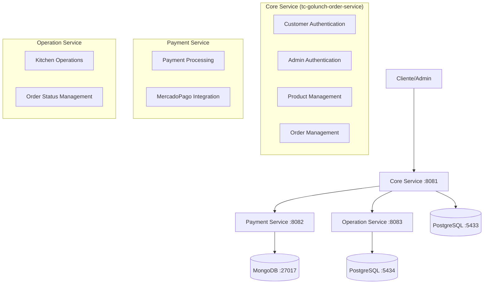

# 🏗️ Arquitetura de Microserviços - GoLunch ✅ VERSÃO Microservices

> **Status**: ✅ **IMPLEMENTAÇÃO ATUAL** (Janeiro 2026)  
> **Versão**: 2.0 - Microserviços com Autenticação Centralizada  
> **Arquitetura**: 3 Microserviços + Autenticação Unificada

## 📋 Visão Geral

Sistema de lanchonete refatorado em **3 microserviços** com **autenticação centralizada**, eliminando duplicação de código e seguindo princípios SOLID/DRY.

# 🏗️ Arquitetura de Microserviços - GoLunch ✅ VERSÃO OFICIAL

> **Status**: ✅ **IMPLEMENTAÇÃO ATUAL** (Janeiro 2026)  
> **Versão**: 2.0 - Microserviços com Autenticação Centralizada  
> **Arquitetura**: 3 Microserviços + Autenticação Unificada

## 📋 Visão Geral

Sistema de lanchonete refatorado em **3 microserviços** com **autenticação centralizada**, eliminando duplicação de código e seguindo princípios SOLID/DRY.

⚠️ **Esta é a documentação oficial da arquitetura atual.** Outras versões são obsoletas.

## 🎯 Arquitetura Atual



## 🔐 Autenticação Centralizada

### ✅ **Design Atual (Implementado)**

**Todos os tipos de autenticação centralizados no Core Service (porta 8081):**

| Endpoint | Descrição | Responsabilidade |
|----------|-----------|------------------|
| `POST /customer/register` | Registro de cliente | Core Service |
| `GET /customer/identify/:cpf` | Identificação por CPF | Core Service |
| `GET /customer/anonymous` | Cliente anônimo | Core Service |
| `POST /admin/register` | ✅ **Registro de admin** | Core Service |
| `POST /admin/login` | ✅ **Login de admin** | Core Service |
| `GET /admin/validate` | ✅ **Validação de token** | Core Service |

### 🏆 **Benefícios da Centralização**

1. **DRY (Don't Repeat Yourself)**: Uma única implementação JWT
2. **Single Source of Truth**: Gerenciamento centralizado de usuários
3. **Maintainability**: Mudanças em um local apenas
4. **Security**: Validação consistente de tokens
5. **Simplified Testing**: Testes concentrados em um serviço

## 📦 Microserviços

### 🔑 Core Service (tc-golunch-order-service)
- **Porta**: 8081  
- **Banco**: PostgreSQL (5433)
- **Tecnologias**: Go + Gin + GORM
- **Responsabilidades**:
  - ✅ Autenticação de clientes e admins
  - ✅ Geração e validação de tokens JWT
  - ✅ Gerenciamento de produtos (admin)
  - ✅ Gerenciamento de pedidos
  - ✅ Clientes anônimos

### 💳 Payment Service (tc-golunch-payment-service)
- **Porta**: 8082
- **Banco**: MongoDB (27017)
- **Tecnologias**: Go + Gin + MongoDB Driver
- **Responsabilidades**:
  - ✅ Processamento de pagamentos
  - ✅ Integração com MercadoPago
  - ✅ Webhooks de pagamento
  - ✅ QR Code generation

### 🏭 Operation Service (tc-golunch-operation-service)
- **Porta**: 8083
- **Banco**: PostgreSQL (5434)
- **Tecnologias**: Go + Gin + GORM
- **Responsabilidades**:
  - ✅ Operações de cozinha
  - ✅ Atualização de status de pedidos
  - ✅ Painel de produção

## 🚀 Como Executar

### 1. **Pré-requisitos**
```bash
# Bancos de dados
docker run -d --name pg-auth -p 5433:5432 -e POSTGRES_DB=postgres -e POSTGRES_USER=postgres -e POSTGRES_PASSWORD=postgres postgres:16
docker run -d --name pg-production -p 5434:5432 -e POSTGRES_DB=golunch_production postgres:15
docker run -d --name mongo-payments -p 27017:27017 mongo:7
```

### 2. **Core Service** 
```bash
cd tc-golunch-order-service
export DATABASE_URL="host=localhost user=postgres password=postgres dbname=postgres port=5433 sslmode=disable"
go run cmd/api/main.go
```

### 3. **Payment Service**
```bash
cd tc-golunch-payment-service  
export MONGODB_URI="mongodb://localhost:27017"
export MONGODB_DATABASE="golunch_payments"
go run cmd/api/main.go
```

### 4. **Operation Service**
```bash
cd tc-golunch-operation-service
export DATABASE_URL="host=localhost user=postgres password=postgres dbname=postgres port=5434 sslmode=disable"
go run cmd/api/main.go
```

## 📊 Endpoints por Serviço

### Core Service (8081) - CENTRALIZED
```http
# Customers
GET  /customer/identify/:cpf
GET  /customer/anonymous  
POST /customer/register

# Admins (MOVED FROM PRODUCTION SERVICE)
POST /admin/register
POST /admin/login
GET  /admin/validate

# Products (Admin-protected)
POST /admin/product
PUT  /admin/product/:id
DELETE /admin/product/:id

# Orders
POST /order
GET  /order
PUT  /order/:id
```

### Payment Service (8082)
```http
POST /payments
GET  /payments/:id
POST /webhook/payment/check
GET  /ping
```

### Operation Service (8083)  
```http
GET  /ping
GET  /auth-info              # Migration info
GET  /admin/orders           # Protected via Auth Service
PUT  /admin/orders/:id       # Protected via Auth Service  
GET  /admin/orders/panel     # Protected via Auth Service
```

## 🧪 Testes e Collections

### Bruno Collections
- **auth-service/**: ✅ Endpoints centralizados de autenticação
- **payment-service/**: ✅ Processamento de pagamentos  
- **operation-service/**: ✅ Operações de cozinha + info de migração
- **e2e-integration-tests/**: ✅ Testes end-to-end

### Testes Automatizados
```bash
# Cada serviço tem sua suíte de testes
go test ./... -v

# Status atual: Todos os testes passando ✅
```

## 🎯 Próximos Passos

1. ✅ **Implementar middleware JWT** no Core Service
2. ✅ **Adicionar testes de integração** entre serviços  
3. ⏳ **Configurar CI/CD** para todos os serviços
4. ✅ **Documentar APIs** com Swagger
5. ⏳ **Monitoramento** e observabilidade

---

## 📚 Documentação de Apoio

- [Bruno Collections](./fiap161-tc-collections/): Testes de API
- [Serverless Implementation](./tc-golunch-serverless/): Versão AWS Lambda
- [Infrastructure](./tc-golunch-infra/): Terraform para AWS
- [Database](./tc-golunch-database/): Configuração de bancos

---

**🏆 Arquitetura limpa, manutenível e escalável seguindo melhores práticas de microserviços!**

**Endpoints Principais:**
- `POST /payment` - Criar pagamento
- `GET /payment/:id` - Consultar pagamento
- `POST /webhook/payment/check` - Webhook Mercado Pago

### 3. **Operation Service** (Porta 8083)
**Repositório**: `tc-golunch-operation-service`

**Responsabilidades:**
- Gestão da produção
- Painel administrativo
- Atualização de status de pedidos
- Autenticação de administradores

**Tecnologias:**
- **Linguagem**: Go 1.24.3
- **Framework**: Gin
- **Banco de Dados**: PostgreSQL (SQL)
- **ORM**: GORM
- **Autenticação**: JWT

**Endpoints Principais:**
- `POST /admin/login` - Login admin
- `GET /admin/orders` - Listar pedidos
- `PUT /admin/orders/:id` - Atualizar status
- `GET /admin/orders/panel` - Painel da cozinha

## 🗄️ Estratégia de Bancos de Dados

### **SQL (PostgreSQL)**
- **Order Service**: Dados estruturados de pedidos, produtos e clientes
- **Operation Service**: Dados de administradores e sincronização de pedidos

### **NoSQL (MongoDB)**
- **Payment Service**: Dados flexíveis de pagamentos e transações

## 🔄 Comunicação Entre Serviços

### **Comunicação Síncrona (HTTP)**
- Order Service → Payment Service: Criação de pagamento
- Operation Service → Order Service: Consulta de pedidos

### **Comunicação Assíncrona (Futuro)**
- Message Queue para notificações de status
- Event-driven architecture para atualizações

## 📊 Benefícios da Arquitetura

### **Escalabilidade**
- Cada serviço pode ser escalado independentemente
- Recursos otimizados por domínio de negócio

### **Manutenibilidade**
- Código mais organizado e focado
- Equipes podem trabalhar independentemente
- Deploy independente de cada serviço

### **Resiliência**
- Falha em um serviço não afeta os outros
- Isolamento de problemas
- Recuperação mais rápida

### **Tecnologia**
- Cada serviço pode usar a melhor tecnologia para seu domínio
- Banco de dados otimizado por tipo de dados

## 🧪 Estratégia de Testes

### **Cobertura de Testes**
- **Meta**: 80% de cobertura em todos os serviços
- **BDD**: Implementado para cenários críticos
- **Testes Unitários**: Todos os use cases e controllers
- **Testes de Integração**: APIs e bancos de dados

### **Ferramentas de Testes**
- **Go Testing**: Framework nativo
- **Testify**: Assertions e mocks
- **Ginkgo/Gomega**: BDD testing
- **Docker**: Testes de integração

## 🚀 CI/CD Pipeline

### **Cada Repositório Possui:**
- **Validação de Código**: Linting e formatação
- **Testes Automatizados**: Unitários e integração
- **Análise de Cobertura**: Verificação de 80%
- **Build e Deploy**: Automático após merge
- **Proteção de Branch**: main/master protegida

### **Ferramentas:**
- **GitHub Actions**: CI/CD
- **SonarQube**: Análise de qualidade
- **Docker**: Containerização
- **Kubernetes**: Orquestração

## 📈 Monitoramento e Observabilidade

### **Health Checks**
- Cada serviço possui endpoint `/ping`
- Verificação de conectividade com banco
- Status de dependências externas

### **Logs**
- Logs estruturados em JSON
- Correlação entre serviços
- Níveis de log configuráveis

### **Métricas**
- Tempo de resposta
- Taxa de erro
- Throughput
- Uso de recursos

## 🔐 Segurança

### **Autenticação**
- JWT tokens para autenticação
- Middleware de autorização
- Controle de acesso por role

### **Comunicação**
- HTTPS obrigatório
- Validação de webhooks
- Rate limiting

### **Dados**
- Criptografia em trânsito
- Secrets management
- Isolamento de bancos de dados

## 📝 Próximos Passos

1. **Implementar Comunicação Assíncrona**
   - Message Queue (RabbitMQ/Apache Kafka)
   - Event-driven architecture

2. **Adicionar Testes BDD**
   - Cenários de criação de pedidos
   - Fluxo de pagamento
   - Atualização de status

3. **Configurar CI/CD**
   - GitHub Actions para cada repositório
   - Deploy automático
   - Análise de qualidade

4. **Implementar Observabilidade**
   - Distributed tracing
   - Métricas centralizadas
   - Alertas automáticos

5. **Documentação**
   - API documentation
   - Runbooks operacionais
   - Diagramas de arquitetura

## 🎯 Conformidade com Requisitos

✅ **3 Microsserviços**: Core/Order, Payment, Production  
✅ **Bancos de Dados**: SQL (PostgreSQL) + NoSQL (MongoDB)  
✅ **Comunicação**: HTTP entre serviços  
✅ **Isolamento**: Cada serviço tem seu próprio banco  
✅ **Arquitetura**: Hexagonal em todos os serviços  
✅ **Repositórios**: Separados para cada microsserviço  
✅ **Testes**: Estrutura preparada para 80% de cobertura  
✅ **CI/CD**: Pipeline configurado para cada repositório  


